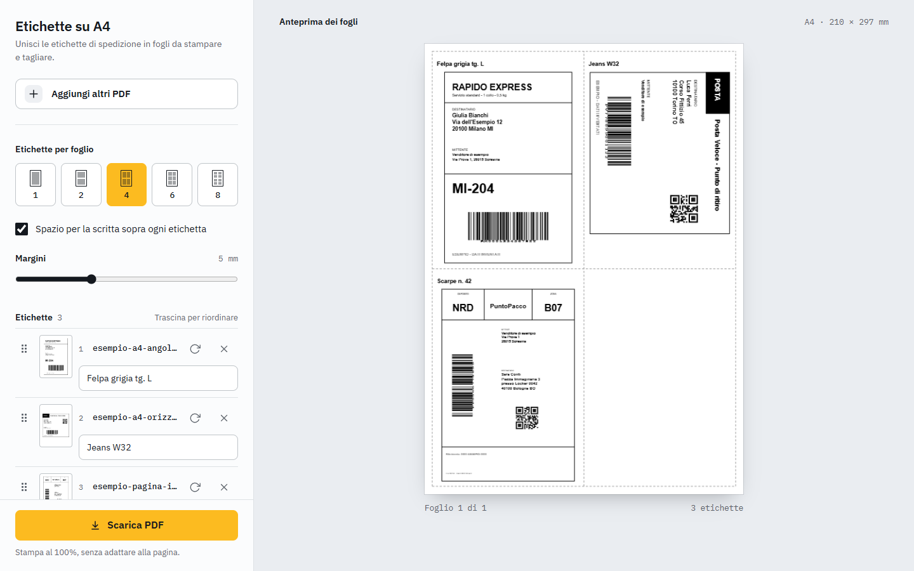

# Etichette su A4

Impagina le etichette di spedizione di Vinted su fogli A4 da stampare e tagliare.

*A browser tool that lays out Vinted shipping labels on A4 sheets, with cut lines and a note above each label. Italian UI, nothing is uploaded.*

**Provalo:** https://proismamaster.github.io/etichette-vinted/



## Cosa fa

Ogni corriere scarica un PDF diverso: DPD e Poste mettono l'etichetta in un angolo di un A4 bianco, InPost occupa tutta la pagina. Il tool ritaglia il bianco intorno a ogni etichetta e le mette insieme sullo stesso foglio, quindi funziona con qualsiasi corriere senza regole dedicate.

- Trascini uno o più PDF: ogni pagina con contenuto diventa un'etichetta, le pagine bianche si saltano.
- Da 1 a 8 etichette per foglio. Ogni etichetta ruota da sola se così viene più grande, senza mai superare la dimensione originale.
- Rotazione manuale a passi di 90° e riordino trascinando la maniglia o con le frecce.
- Margini da 0 a 15 mm e linee tratteggiate per il taglio.
- Sopra ogni etichetta una scritta per ricordare cosa va nel pacco, oppure una riga vuota da riempire a penna.
- L'anteprima è il PDF finale, non un'imitazione.
- Tema chiaro e scuro, layout a schede sul telefono.

Stampa al 100%, senza "adatta alla pagina".

Non hai etichette sotto mano? In [`docs/demo/`](docs/demo/) ci sono tre PDF di esempio con dati inventati, nei tre formati più comuni.

## Privacy

I PDF non lasciano il dispositivo. Tutto avviene nel browser e non c'è nessun server: dalla rete arrivano solo le librerie e i font.

## Come funziona

- [pdf.js](https://mozilla.github.io/pdf.js/) disegna ogni pagina su un canvas e trova il riquadro dei pixel non bianchi.
- [pdf-lib](https://pdf-lib.js.org/) incolla quel riquadro come vettore nel foglio A4, così i codici a barre restano nitidi a qualsiasi scala.
- Un solo file, `index.html`, senza build. Le funzioni di impaginazione stanno nel blocco `<script id="core">`, senza DOM, e `test.mjs` le prova.

## In locale

Apri `index.html` nel browser, oppure:

```bash
python -m http.server 8765
```

Test (Node 18 o più recente):

```bash
node test.mjs
```

## Autore

[Ismail Barakat](https://ismailbarakat.dev)
